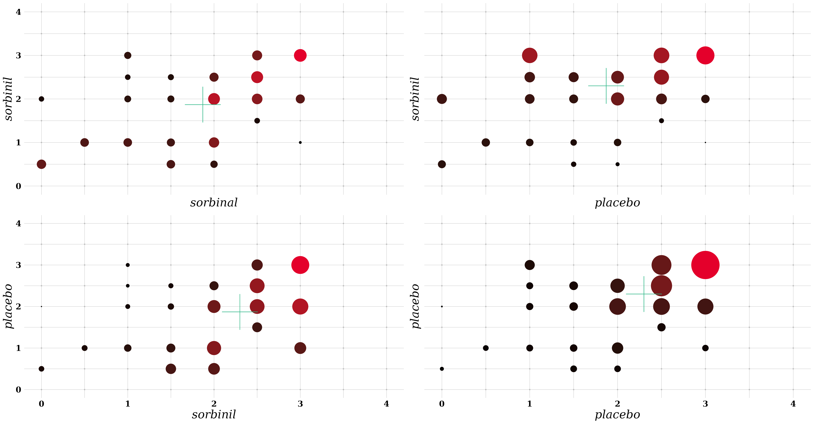

# Data 61 Introductory Talk

<!--toc:start-->
- [Title](#title)
  - [Description](#description)
  - [Author](#author)
  - [License](#license)
<!--toc:end-->

## Description

<!-- Description -->
Introductory talk given at D61.

# Sorbinal Model 

# ButterFly Model

14 Dimensional Vector Regression Model of Butterflys.

# Simulation Results

## Model

### Specification

### Results

## Power Surface  

## Author

- [@den173](mailto:gabrieldennis17@gmail.com)

## License

<!-- License -->

 

